# BÁO CÁO CHI TIẾT CÁC LỖI HỆ THỐNG (BUG REPORT) - ESHOP SUT

---

## Nội dung mô tả chi tiết từng lỗi

### Tính năng A: FR-03 – Quên mật khẩu và Đặt lại mật khẩu

#### Bug 1: Lộ mã OTP đặt lại mật khẩu trong phản hồi API
*   **Tiêu đề Issue:** `[Bug] [FR-03] OTP token leaked in forgot-password API response`
*   **Thành phần (Component):** Backend API (`/api/forgot-password`)
*   **Mức độ nghiêm trọng (Severity):** **Critical** (Nghiêm trọng - Lỗ hổng bảo mật)
*   **Mô tả chi tiết:**
    Khi người dùng yêu cầu mã đặt lại mật khẩu (OTP) qua email, hệ thống sinh ra một mã OTP gồm 4 chữ số. Tuy nhiên, thay vì chỉ lưu trữ trong database và gửi kín qua email, API Backend lại trả về trực tiếp mã OTP này trong Response Body gửi về cho Client. Điều này cho phép bất kỳ ai biết email của nạn nhân đều có thể gửi request và lấy mã OTP từ API Response để đổi mật khẩu tài khoản.
*   **Các bước tái hiện (Steps to Reproduce):**
    1. Sử dụng Postman gửi một request `POST` đến địa chỉ: `http://localhost:3000/api/forgot-password`
    2. Thiết lập Body ở định dạng `JSON` như sau:
       ```json
       {
         "email": "test@eshop.com"
       }
       ```
    3. Nhấn **Send** và kiểm tra nội dung Response Body.
*   **Kết quả kỳ vọng (Expected Result):**
    API chỉ trả về thông điệp thành công, ví dụ: `{"message": "Mã đặt lại mật khẩu đã được gửi đến email của bạn."}`. Mã OTP (`resetToken`) tuyệt đối không được xuất hiện trong Response.
*   **Kết quả thực tế (Actual Result):**
    API trả về mã OTP trực tiếp trong JSON Response:
    ```json
    {
      "message": "Mã đặt lại mật khẩu đã được tạo",
      "resetToken": "2452"
    }
    ```
*   **Minh chứng (Screenshot/Link):** 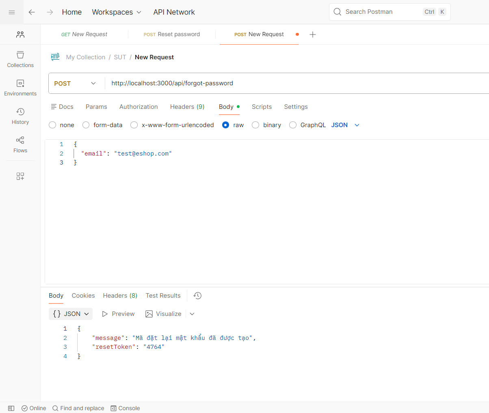
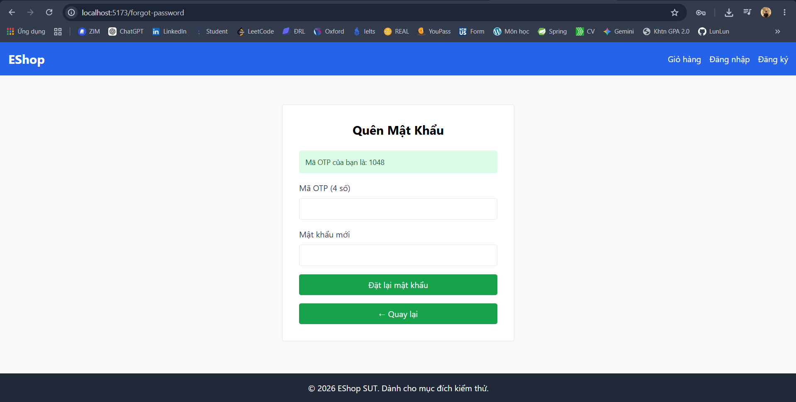

---

#### Bug 2: Thiếu xác thực độ mạnh mật khẩu mới tại Backend khi đặt lại mật khẩu
*   **Tiêu đề Issue:** `[Bug] [FR-03] Missing new password strength validation in reset-password API`
*   **Thành phần (Component):** Backend API (`/api/reset-password`)
*   **Mức độ nghiêm trọng (Severity):** **High** (Cao)
*   **Mô tả chi tiết:**
    Hệ thống có cơ chế kiểm duyệt mật khẩu mạnh ở phía giao diện Web (Frontend), bắt buộc mật khẩu phải dài từ 8 ký tự trở lên, chứa chữ hoa, chữ thường, chữ số và ký tự đặc biệt. Tuy nhiên, API Backend lại hoàn toàn không thực hiện kiểm tra này. Kẻ tấn công có thể vượt qua giao diện (bằng Postman/cURL) để gửi yêu cầu đặt lại mật khẩu quá ngắn hoặc rỗng, làm giảm tính bảo mật của tài khoản.
*   **Các bước tái hiện (Steps to Reproduce):**
    1. Tạo yêu cầu quên mật khẩu để có OTP cho tài khoản `test@eshop.com`.
    2. Sử dụng Postman gửi request `POST` đến `http://localhost:3000/api/reset-password`.
    3. Định dạng Body dạng `JSON` với mật khẩu mới là một dấu chấm hoặc chuỗi rỗng:
       ```json
       {
         "email": "test@eshop.com",
         "resetToken": "2452",
         "newPassword": "."
       }
       ```
    4. Nhấn **Send** và kiểm tra phản hồi.
*   **Kết quả kỳ vọng (Expected Result):**
    Backend từ chối cập nhật mật khẩu, phản hồi mã lỗi `400 Bad Request` cùng mô tả lỗi: `"Mật khẩu không đủ độ mạnh theo quy định."`.
*   **Kết quả thực tế (Actual Result):**
    Backend lưu mật khẩu mới thành công, phản hồi HTTP `200 OK` với thông điệp:
    ```json
    {
      "message": "Password reset successfully"
    }
    ```
*   **Minh chứng (Screenshot/Link):** 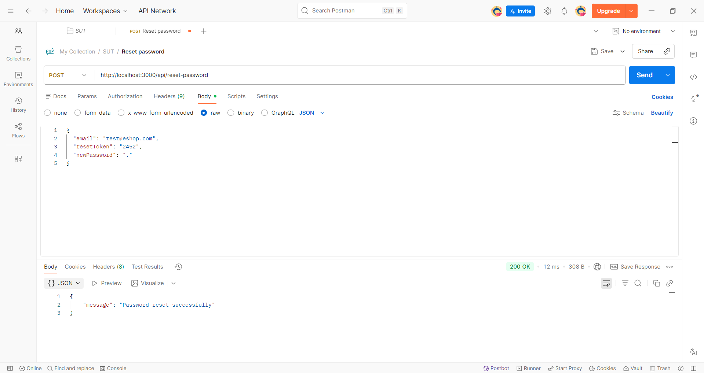

---

### Tính năng B: FR-09 – Mã giảm giá (Discount Coupons)

#### Bug 3: Sai công thức tính số tiền giảm giá theo phần trăm (%)
*   **Tiêu đề Issue:** `[Bug] [FR-09] Incorrect percentage coupon discount calculation`
*   **Thành phần (Component):** Backend API (`/api/apply-coupon`)
*   **Mức độ nghiêm trọng (Severity):** **Critical** (Nghiêm trọng - Thất thoát tài chính)
*   **Mô tả chi tiết:**
    Tại endpoint áp dụng mã giảm giá, khi coupon có loại giảm giá là phần trăm (`percent`), công thức trong mã nguồn backend bị tính sai hệ số. Cụ thể, thay vì chia giá trị phần trăm cho 100, backend lại lấy trực tiếp số phần trăm đó thực hiện tính toán. Khi người dùng áp dụng mã giảm 10%, hệ thống nhân tổng tiền đơn hàng với hệ số `-9` làm tổng tiền cuối cùng bị âm nặng hoặc nhảy vọt sai lệch.
*   **Các bước tái hiện (Steps to Reproduce):**
    1. Chuẩn bị giỏ hàng với tổng tiền đơn hàng là `6,000,000` ₫.
    2. Áp dụng mã giảm giá `SAVE10` (giảm 10% đơn hàng, min_order_amount = 6,000,000 ₫).
*   **Kết quả kỳ vọng (Expected Result):**
    Số tiền được giảm: `6,000,000 * 10% = 600,000` ₫. Số tiền thanh toán cuối cùng: `5,400,000` ₫.
*   **Kết quả thực tế (Actual Result):**
    Hệ thống tính toán ra số tiền thanh toán cuối cùng là `-54,000,000` ₫ (Số tiền âm, khách hàng không những không trả tiền mà còn được cộng tiền).
*   **Minh chứng (Screenshot/Link):** 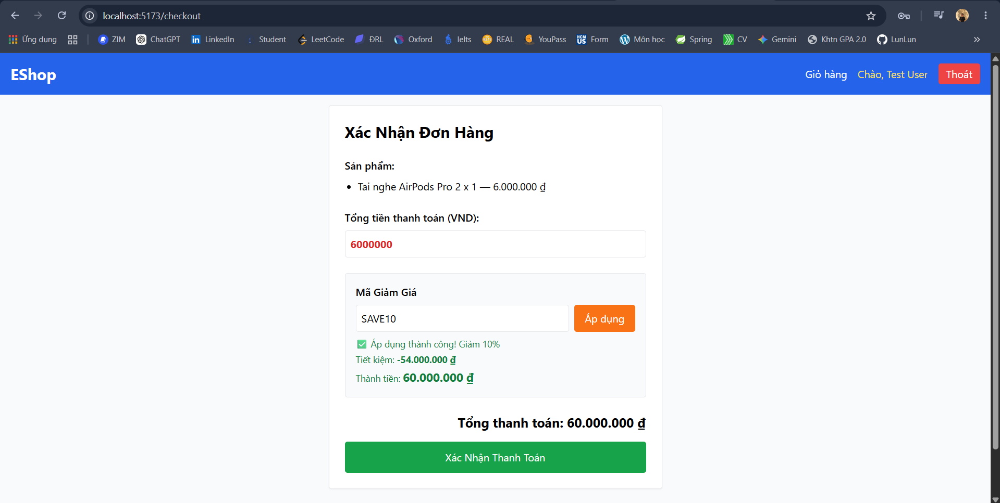

---

#### Bug 4: Kiểm tra điều kiện đơn hàng tối thiểu bị lỗi biên lệch 1 đơn vị (Off-by-one)
*   **Tiêu đề Issue:** `[Bug] [FR-09] Coupon min_order_amount boundary check uses '>' instead of '>='`
*   **Thành phần (Component):** Backend API (`/api/apply-coupon`)
*   **Mức độ nghiêm trọng (Severity):** **Medium** (Trung bình)
*   **Mô tả chi tiết:**
    Mã giảm giá yêu cầu số tiền đơn hàng tối thiểu là $X$ ₫ mới được áp dụng. Tuy nhiên, logic backend sử dụng toán tử so sánh lớn hơn hẳn `>` thay vì lớn hơn hoặc bằng `>=`. Điều này làm cho các đơn hàng có tổng tiền đúng bằng ngưỡng $X$ bị từ chối áp dụng mã giảm giá một cách vô lý.
*   **Các bước tái hiện (Steps to Reproduce):**
    1. Chọn mã giảm giá `SAVE10` có giá trị tối thiểu (`min_order_amount`) là `300,000` ₫.
    2. Tạo giỏ hàng có tổng số tiền đúng bằng `300,000` ₫.
    3. Gửi request áp dụng mã giảm giá.
*   **Kết quả kỳ vọng (Expected Result):**
    Mã giảm giá được áp dụng thành công vì tổng tiền giỏ hàng đạt đúng ngưỡng biên yêu cầu.
*   **Kết quả thực tế (Actual Result):**
    Hệ thống phản hồi lỗi: `"Đơn hàng chưa đạt giá trị tối thiểu để áp dụng mã giảm giá."` do logic kiểm tra dùng: `total_amount > min_order_amount` (300,000 > 300,000 => Sai).
*   **Minh chứng (Screenshot/Link):** 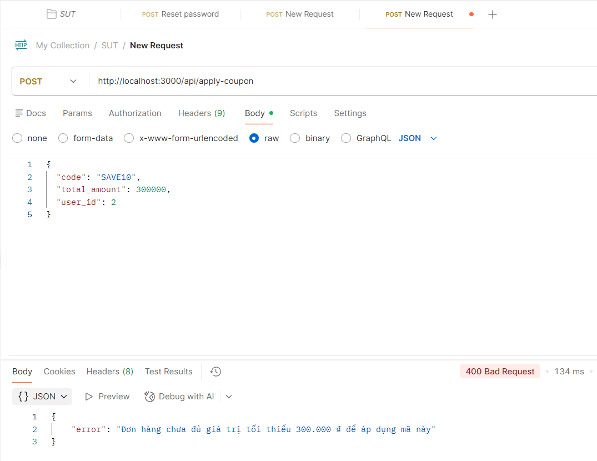
---
#### Bug 5: Lỗi biểu thức chính quy (Regex) xác thực mật khẩu trên giao diện Web chặn mật khẩu mạnh
*   **Tiêu đề Issue:** `[Bug] [FR-03 UI] Forgot Password validation regex rejects strong passwords and requires whitespace`
*   **Thành phần (Component):** Frontend Web (`ForgotPassword.jsx`)
*   **Mức độ nghiêm trọng (Severity):** **High** (Cao)
*   **Mô tả chi tiết:**
    Giao diện Web của tính năng Đặt lại mật khẩu sử dụng biểu thức chính quy `flawedStrongPasswordRegex` bị lỗi: `/^(?=.*[a-z])(?=.*[A-Z])(?=.*\d)(?=.*\s)[A-Za-z\d\s]{8,}$/`.
    - Biểu thức này bắt buộc mật khẩu phải chứa ký tự khoảng trắng (`\s`) và CHỈ cho phép chữ cái, chữ số và khoảng trắng.
    - Điều này dẫn tới việc nếu người dùng nhập một mật khẩu mạnh chuẩn chứa ký tự đặc biệt (ví dụ `Abcd123!`), giao diện sẽ từ chối và báo mật khẩu quá yếu (dù thông báo cảnh báo yêu cầu phải có ký tự đặc biệt). Ngược lại, nếu nhập mật khẩu có khoảng trắng như `Abcd 1234` (không có ký tự đặc biệt), hệ thống lại cho phép lưu.
*   **Các bước tái hiện (Steps to Reproduce):**
    1. Truy cập trang Quên mật khẩu trên giao diện Web: `http://localhost:5173/forgot-password`.
    2. Nhập email `test@eshop.com` để lấy OTP.
    3. Điền mã OTP, và tại ô Mật khẩu mới, nhập mật khẩu mạnh chứa ký tự đặc biệt: `Abcd123!`.
    4. Bấm **Đặt lại mật khẩu**.
*   **Kết quả kỳ vọng (Expected Result):**
    Hệ thống chấp nhận mật khẩu mạnh `Abcd123!` và thực hiện đổi mật khẩu thành công.
*   **Kết quả thực tế (Actual Result):**
    Trình duyệt hiển thị cảnh báo alert: `"Mật khẩu quá yếu! Phải dài tối thiểu 8 ký tự, gồm chữ hoa, chữ thường, số và KÝ TỰ ĐẶC BIỆT."` và chặn không cho đổi mật khẩu.
*   **Minh chứng (Screenshot/Link):** 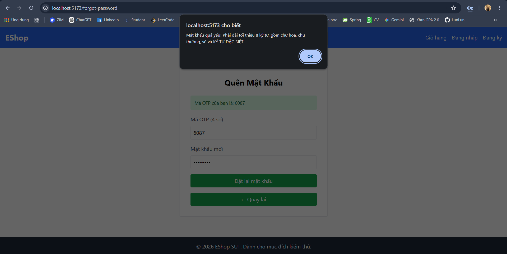

---

### Tính năng C: FR-14 – Quản lý danh mục (Category CRUD)

#### Bug 6: Không chặn xóa danh mục đang có sản phẩm liên kết gây lỗi toàn vẹn dữ liệu
*   **Tiêu đề Issue:** `[Bug] [FR-14] Deleting category with active products results in orphaned database records`
*   **Thành phần (Component):** Backend API (`DELETE /api/categories/:id`)
*   **Mức độ nghiêm trọng (Severity):** **High** (Cao)
*   **Mô tả chi tiết:**
    Khi thực hiện xóa một danh mục sản phẩm qua API DELETE, hệ thống không hề thực hiện kiểm tra xem danh mục đó có đang chứa sản phẩm nào hay không. SQLite mặc định không bật tính năng kiểm tra khóa ngoại (`Foreign Key Constraints`) trừ khi được bật thủ công, dẫn tới việc danh mục bị xóa thành công và để lại các sản phẩm bị mồ côi (category_id trỏ tới ID không còn tồn tại).
*   **Các bước tái hiện (Steps to Reproduce):**
    1. Xác định danh mục Điện thoại (ID = 1) đang chứa các sản phẩm như iPhone, Samsung.
    2. Sử dụng Postman gửi request `DELETE` tới địa chỉ: `http://localhost:3000/api/categories/1` kèm token Admin.
    3. Kiểm tra xem danh mục đã bị xóa chưa và kiểm tra lại danh sách sản phẩm.
*   **Kết quả kỳ vọng (Expected Result):**
    Hệ thống chặn thao tác xóa và phản hồi lỗi: `"Không thể xóa danh mục đang chứa sản phẩm liên kết."` để đảm bảo tính toàn vẹn dữ liệu.
*   **Kết quả thực tế (Actual Result):**
    Phản hồi `200 OK` báo xóa thành công. Các sản phẩm của danh mục ID 1 bị mất liên kết danh mục gốc, CSDL rơi vào trạng thái lỗi toàn vẹn dữ liệu.
*   **Minh chứng (Screenshot/Link):** 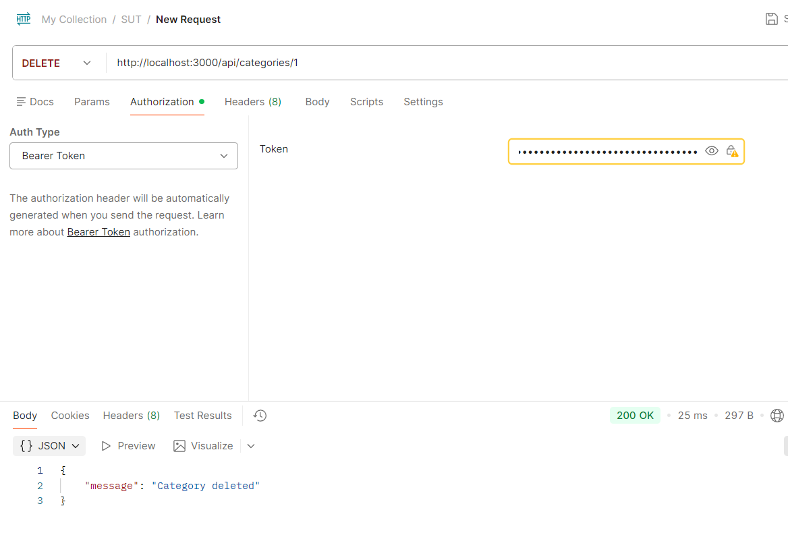

---

#### Bug 7: Cho phép tạo danh mục có tên trùng lặp
*   **Tiêu đề Issue:** `[Bug] [FR-14] Creating category allows duplicate names`
*   **Thành phần (Component):** Backend API (`POST /api/categories`)
*   **Mức độ nghiêm trọng (Severity):** **Medium** (Trung bình)
*   **Mô tả chi tiết:**
    Cơ sở dữ liệu SQLite và API tạo mới danh mục không thiết lập ràng buộc duy nhất (`UNIQUE`) cho tên danh mục, cũng như không viết code validate kiểm tra xem tên danh mục đã tồn tại hay chưa. Điều này dẫn tới việc người dùng admin có thể tạo nhiều danh mục có tên giống hệt nhau, gây nhầm lẫn trên giao diện mua sắm.
*   **Các bước tái hiện (Steps to Reproduce):**
    1. Gửi request `POST` tạo danh mục mới tên là `"Laptop"` (đã tồn tại trong DB mặc định).
       `URL: http://localhost:3000/api/categories`
    2. Body JSON:
       ```json
       {
         "name": "Laptop"
       }
       ```
    3. Nhấn **Send** và kiểm tra phản hồi.
*   **Kết quả kỳ vọng (Expected Result):**
    Hệ thống báo lỗi `400 Bad Request` hoặc `409 Conflict`: `"Tên danh mục đã tồn tại."`
*   **Kết quả thực tế (Actual Result):**
    Tạo thành công thêm một danh mục mới có tên là `"Laptop"` với ID tự tăng mới.
*   **Minh chứng (Screenshot/Link):** 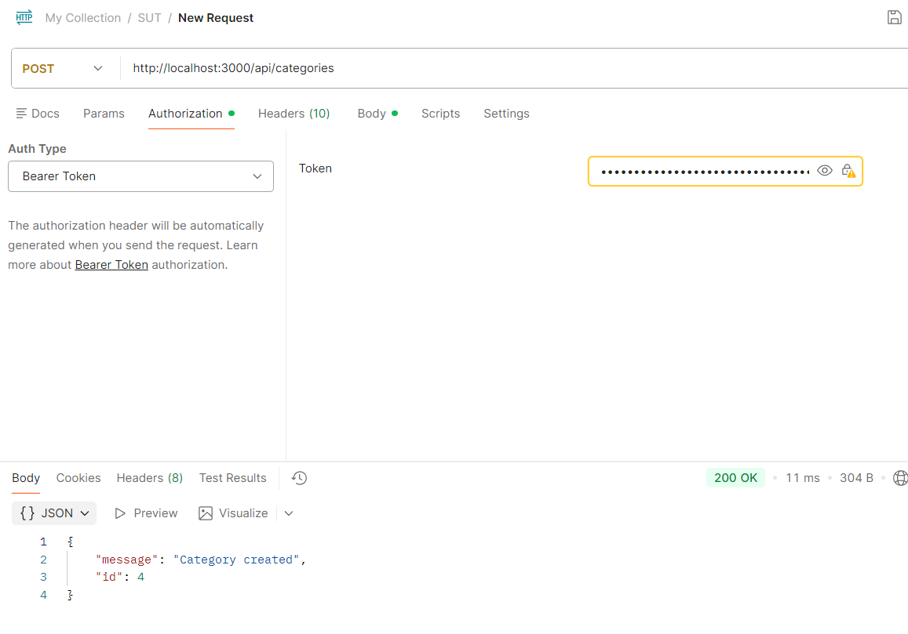

---

#### Bug 8: Sửa hoặc xóa danh mục có ID không tồn tại vẫn trả về HTTP 200 OK
*   **Tiêu đề Issue:** `[Bug] [FR-14] Category PUT/DELETE APIs return '200 OK' for non-existent IDs`
*   **Thành phần (Component):** Backend API (`PUT /api/categories/:id`, `DELETE /api/categories/:id`)
*   **Mức độ nghiêm trọng (Severity):** **Low** (Thấp)
*   **Mô tả chi tiết:**
    Khi gửi yêu cầu cập nhật hoặc xóa một danh mục bằng ID không tồn tại trong hệ thống (ví dụ ID: `99999`), backend vẫn thực hiện câu lệnh SQL mà không kiểm tra số lượng bản ghi bị thay đổi (`this.changes`). Kết quả là API luôn trả về mã thành công `200 OK` gây sai lệch về mặt logic nghiệp vụ API.
*   **Các bước tái hiện (Steps to Reproduce):**
    1. Gửi request `DELETE` tới địa chỉ: `http://localhost:3000/api/categories/99999`.
    2. Gửi request `PUT` tới địa chỉ: `http://localhost:3000/api/categories/99999` với body JSON:
       ```json
       {
         "name": "Thay đổi"
       }
       ```
    3. Kiểm tra mã trạng thái HTTP và phản hồi trả về.
*   **Kết quả kỳ vọng (Expected Result):**
    API trả về mã lỗi `404 Not Found` và thông báo `"Danh mục không tồn tại."`.
*   **Kết quả thực tế (Actual Result):**
    Cả hai API đều phản hồi `200 OK` với thông điệp: `"Category deleted"` hoặc `"Category updated"` dù không có danh mục nào bị thay đổi.
*   **Minh chứng (Screenshot/Link):** 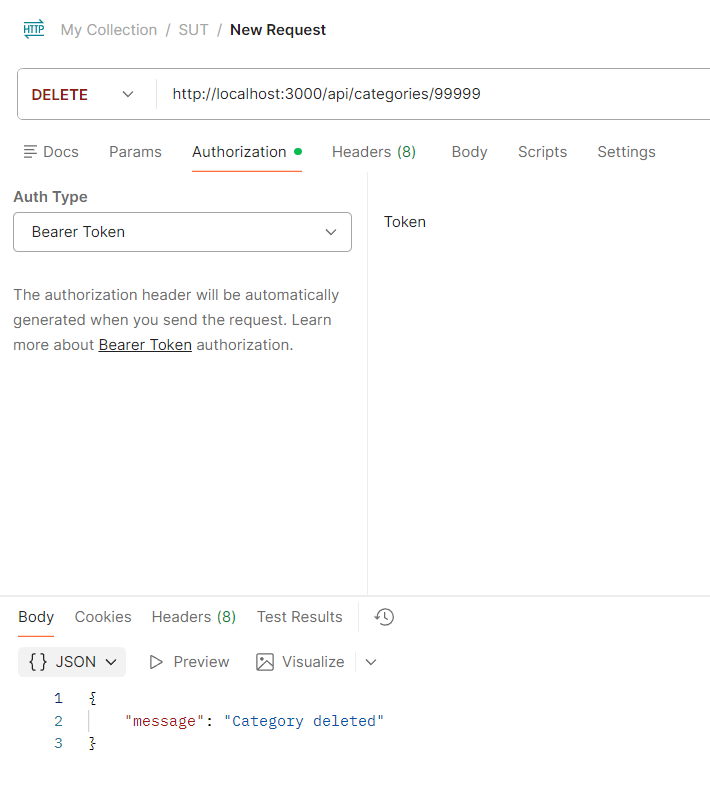
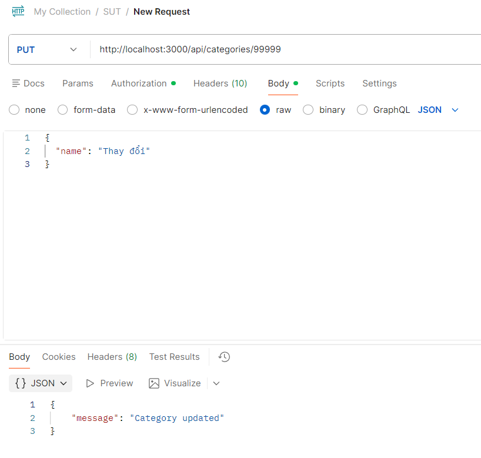

---

### Tính năng D: Mobile App – Tìm kiếm sản phẩm (Product Search)

#### Bug 9: Lỗ hổng bảo mật SQL Injection nghiêm trọng trong ô tìm kiếm sản phẩm
*   **Tiêu đề Issue:** `[Bug] [FR-05 Mobile] SQL Injection vulnerability in product search API`
*   **Thành phần (Component):** Backend API (`GET /api/products?search=`)
*   **Mức độ nghiêm trọng (Severity):** **Critical** (Nghiêm trọng - Lỗ hổng bảo mật)
*   **Mô tả chi tiết:**
    Trong mã nguồn của API tìm kiếm sản phẩm tại backend, chuỗi từ khóa tìm kiếm (`search`) được nối chuỗi trực tiếp vào câu lệnh SQL SELECT bằng cú pháp Template Literal (dấu backtick) thay vì sử dụng cơ chế Parameterized Query (Truy vấn tham số hóa). Điều này tạo điều kiện cho hacker thực hiện SQL Injection để xem toàn bộ dữ liệu nhạy cảm hoặc can thiệp bất hợp pháp vào cơ sở dữ liệu.
*   **Các bước tái hiện (Steps to Reproduce):**
    1. Gửi một request `GET` đến endpoint tìm kiếm với payload SQL Injection:
       `http://localhost:3000/api/products?search=iphone%' OR '1'='1`
    2. Quan sát kết quả trả về trong Response Body.
*   **Kết quả kỳ vọng (Expected Result):**
    Hệ thống xử lý an toàn bằng Parameterized Query, tìm sản phẩm chứa nguyên văn chuỗi `iphone%' OR '1'='1` và trả về kết quả trống (0 sản phẩm).
*   **Kết quả thực tế (Actual Result):**
    Hệ thống thực thi câu lệnh SQLi, trả về toàn bộ sản phẩm hiện có trong cơ sở dữ liệu (SQL Injection thành công).
*   **Minh chứng (Screenshot/Link):** 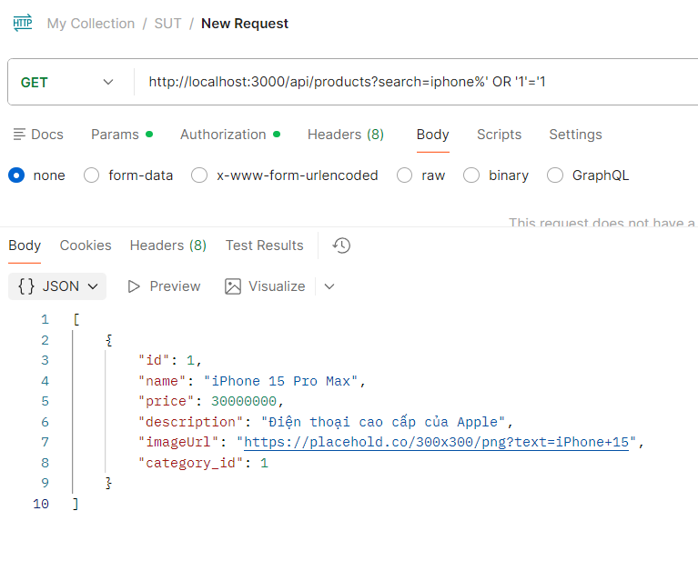

---

#### Bug 10: Phản hồi lỗi SQL dạng HTML thô của backend làm hỏng giao diện Mobile App (Crash UI)
*   **Tiêu đề Issue:** `[Bug] [FR-05 Mobile] Raw HTML database error page crashes mobile app on SQL error`
*   **Thành phần (Component):** Mobile Frontend (`App.js`) & Backend API
*   **Mức độ nghiêm trọng (Severity):** **High** (Cao)
*   **Mô tả chi tiết:**
    Khi xảy ra lỗi cú pháp truy vấn cơ sở dữ liệu (ví dụ người dùng cố tình nhập dấu nháy đơn `'` trong ô tìm kiếm làm hỏng cú pháp câu lệnh SQL của backend), thay vì trả về lỗi có định dạng JSON chuẩn (ví dụ `{"error": "Database error"}`), backend lại phản hồi một trang lỗi HTML thô. Ứng dụng di động (React Native) cố gắng parse dữ liệu này dưới dạng JSON làm phát sinh lỗi uncaught exception, gây lỗi giao diện hoặc treo/crash ứng dụng.
*   **Các bước tái hiện (Steps to Reproduce):**
    1. Mở ô tìm kiếm trên ứng dụng di động (hoặc gửi request qua Postman).
    2. Nhập vào ô tìm kiếm đúng 1 ký tự nháy đơn: `'`
    3. Thực hiện tìm kiếm và quan sát giao diện mobile app.
*   **Kết quả kỳ vọng (Expected Result):**
    API trả về mã lỗi JSON chuẩn. Mobile App xử lý lỗi êm đẹp và hiển thị thông báo thân thiện: "Có lỗi xảy ra khi tìm kiếm, vui lòng thử lại."
*   **Kết quả thực tế (Actual Result):**
    Backend trả về HTML lỗi của Express: `<h1>Database Error</h1>...`. Trên màn hình di động hiển thị nội dung HTML thô này dưới dạng văn bản không định dạng, làm vỡ hoàn toàn giao diện ứng dụng.
*   **Minh chứng (Screenshot/Link):** 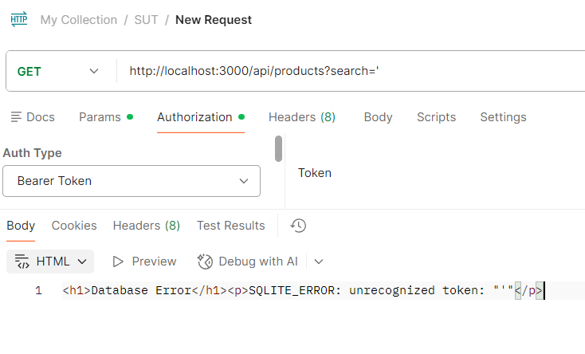

---

#### Bug 11: Không làm sạch ký tự đại diện wildcard (%) và (_) dẫn tới kết quả tìm kiếm sai lệch
*   **Tiêu đề Issue:** `[Bug] [FR-05 Mobile] Search query does not escape wildcard characters '%' and '_'`
*   **Thành phần (Component):** Backend API (`GET /api/products?search=`)
*   **Mức độ nghiêm trọng (Severity):** **Medium** (Trung bình)
*   **Mô tả chi tiết:**
    Ký tự phần trăm `%` và dấu gạch dưới `_` là các ký tự đại diện (wildcard) trong mệnh đề `LIKE` của SQL. Khi người dùng nhập các ký tự này vào ô tìm kiếm, backend không thực hiện cơ chế escape (làm sạch). Điều này khiến cơ sở dữ liệu hiểu nhầm rằng người dùng muốn tìm kiếm mọi ký tự, dẫn tới trả về toàn bộ danh sách sản phẩm thay vì tìm đúng sản phẩm chứa ký tự `%` hoặc `_`.
*   **Các bước tái hiện (Steps to Reproduce):**
    1. Nhập ký tự `%` vào ô tìm kiếm trên Mobile App.
    2. Nhấn nút Tìm kiếm.
*   **Kết quả kỳ vọng (Expected Result):**
    Chỉ trả về các sản phẩm có chứa ký tự `%` thực tế trong tên (hoặc báo không tìm thấy sản phẩm nào).
*   **Kết quả thực tế (Actual Result):**
    Hệ thống trả về toàn bộ sản phẩm có trong cơ sở dữ liệu.
*   **Minh chứng (Screenshot/Link):** 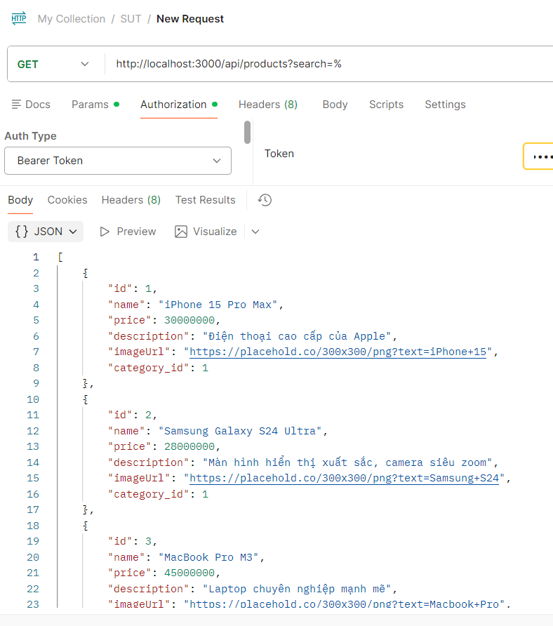
